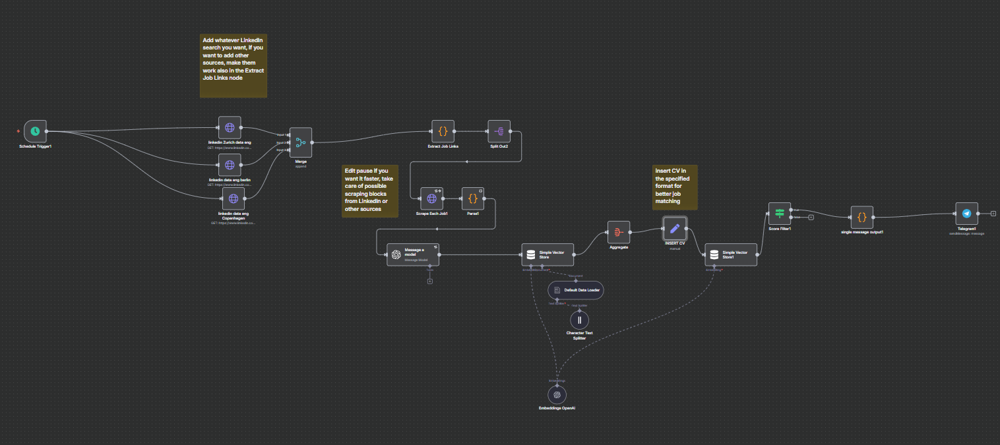

# 🚀 AI-Powered Dream Job Matcher (n8n Workflow)



This **n8n workflow** automates the process of finding and scoring job opportunities from LinkedIn against your professional profile (CV).  
It uses **job scraping, vector storage for semantic matching, OpenAI for intelligent data processing, and Telegram for real-time notifications** of highly-matched jobs.

---

## ✨ Features
- **Scheduled Job Scraping**: Periodically extracts new job links from specified LinkedIn searches.  
- **Intelligent Job Formatting**: Uses OpenAI to format and enrich scraped job descriptions.  
- **Vector Store Matching**: Embeds your CV and job descriptions into a vector database for high-precision, semantic similarity scoring.  
- **Customizable CV Profile**: Easily update your skills, experience, and certifications for better matching accuracy.  
- **Real-time Alerts**: Sends immediate notifications for high-scoring job matches via Telegram.  

---

## 🛠️ Prerequisites
To run this pipeline successfully, you need:

- **n8n Instance**: Access to a running n8n instance (self-hosted or cloud), easiest is through docker.  
- **Pipeline YAML**: Download or clone the dream_job_matcher.yaml.  
- **OpenAI API Key**: For text processing, embeddings, and job description formatting, you can use another API, but then need to adjust the pipeline accordingly.  
- **Telegram Bot**: A configured Telegram bot token and your personal chat ID for receiving notifications.  
---

## ⚙️ Configuration Steps

### 1. Import the Workflow
- Open your n8n instance.  
- Navigate to **Workflows** → click **Create Workflow** and then on the three dots on top right **Import from File**.  
- Upload the provided YAML file for this job pipeline.  

### 2. Set Up Credentials
- **OpenAI Credential**:  
  - Locate the OpenAI node (used for formatting and embeddings).  
  - Add your **OpenAI API Key** as a new credential.  

- **Telegram Credential**:  
  - Locate the Telegram node (at the end of the pipeline).  
  - Add your **Telegram Bot Token**.  
  - Ensure your **personal Chat ID** is set in the message body.  

### 3. Update LinkedIn Search Queries
- Locate the **LinkedIn job scraping nodes** (`LinkedIn data eng ...`).  
- Update the input search links in the **Extract Job Links** node to match your job searches, TIP: go on LinkedIn add your filters and then copy and paste the URL.  
- You can add or remove LinkedIn nodes as needed, ensuring all outputs feed into the **first Merge node**.  

### 4. 📝 Insert Your CV Data (Crucial Step)
The matching quality depends on how well your CV is represented in the vector store.

- Locate the **INSERT CV** node.  
- Replace the placeholder with your CV in string format:  

```json
  "title": "Data & Machine Learning Engineer",
  "skills": [
    "Python",
    "SQL",
    "NoSQL",
    "Databricks",
    "Apache Spark",
    "Airflow",
    "Google Cloud Platform",
    "BigQuery",
    "AWS",
    "Azure",
    "Composer",
    "IAM",
    "IBM DataStage",
    "VectorDB",
    "Qdrant",
    "Machine Learning",
    "Artificial Intelligence",
    "Data Engineering",
    "Data Orchestration",
    "ETL",
    "RAG",
    "Scikit-learn",
    "Streamlit",
    "LangChain",
    "Docker",
    "Data Structures & Algorithms",
    "Cloud Deployment",
    "GitHub",
    "N8N"
  ],
  "experience_summary": [
    "Built scalable data pipelines in Databricks (Medallion Architecture).",
    "Migrated Airflow DAGs to GCP Composer 2.x with 10x efficiency gain.",
    "Implemented SCD Type 2 for historical data optimization.",
    "Optimized IBM DataStage ETL workflows and SQL queries.",
    "Developed RAG pipelines using OpenAI embeddings + vector databases.",
    "Researched GANs and AI security risks (deepfakes, membership inference)."
  ],
  "certifications": [
    "Google Cloud Professional Machine Learning Engineer",
    "AWS Machine Learning Specialty",
    "Databricks Certified Associate Developer for Apache Spark",
    "Databricks Certified Data Engineer Associate",
    "Neo4j Certified Professional"
  ]
```

### 5. Adjust the Score Filter
Locate the Node: Find the Score Filter node.

Action: This node controls the minimum similarity score (e.g., > 0.85) required for a job to be sent to Telegram. Adjust this threshold to fine-tune the sensitivity of your notifications.

### ▶️ Running the Workflow
Set the workflow to Active.

- The workflow is typically set up with a Schedule Trigger node to run automatically (e.g., once a day).
- You can manually trigger a test run by clicking Execute Workflow.
- All job matches that pass the Score Filter will be sent to the configured Telegram chat.


If this lends your dream job you can buy me a coffe, if it doesn't let's connect and make it better!

[](https://buymeacoffee.com/fedeflowers)


